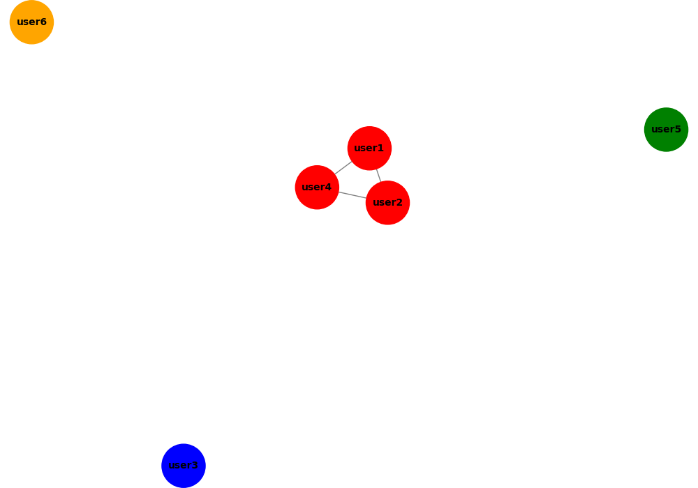

# OSINT Social Network Analyzer

An intelligence tool that detects relationships between users based on text similarity.

## Features

- Message similarity analysis  
- Detection of coordinated activity  
- Network visualization using graphs  

## Technologies

- Python  
- NetworkX  
- Scikit-learn  
- Matplotlib  

## Usage

```bash
python main.py

## 📊 Example



## 🕵️ Use Cases

- Detection of coordinated bot activity  
- Social network analysis  
- OSINT investigations  
- Disinformation campaign detection

## ⚙️ How it Works

This tool uses TF-IDF vectorization and cosine similarity to identify relationships between users based on textual similarity. It then builds a network graph and detects communities using graph clustering algorithms.

## 🚀 Future Improvements

- Real-time data ingestion  
- Integration with social media APIs  
- Dashboard visualization  
